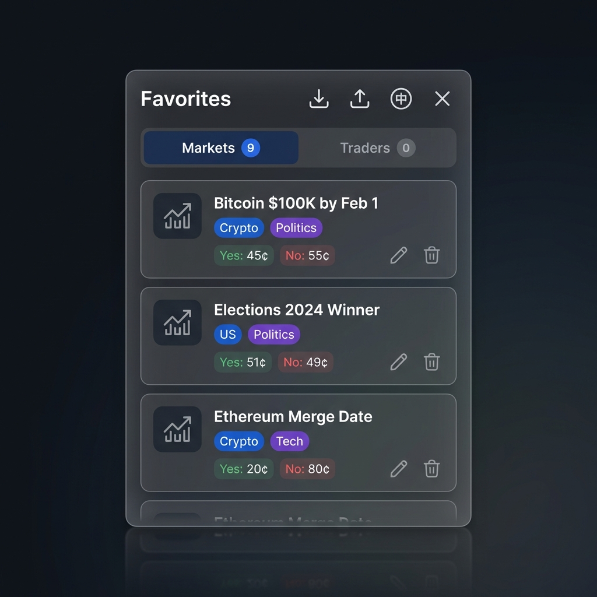

# Polymarket Favorites

  

  
    
  
  

  <strong>The missing favorites feature for Polymarket.</strong> 
  Track markets and traders • Organize with colorful tags • Never miss an opportunity

---

[English](#english) | [中文](#中文)

---

## 🎯 What is this?

Polymarket Favorites adds a powerful **favorites sidebar** to Polymarket.com. Save markets and traders you want to follow, organize them with custom tags, and access them from any page.

## ✨ Features

- ⭐ **One-Click Favorites**: Save any market or trader with a single click.
- 🖼️ **Auto Logo Capture**: Automatically captures market icons and trader avatars.
- 🏷️ **Colorful Tags**: Organize with auto-colored tags for better categorization.
- ✏️ **Custom Notes**: Add personal notes and rename items for better organization.
- ↔️↕️ **Resizable UI**: Drag edges to adjust width/height to your preference.
- 📤 **Export/Import**: Backup and restore your data as JSON. 
- 🤝 **Share & Merge**: Share your trader lists with friends! Imports **safely merge** without overwriting your existing notes.
- 🔒 **100% Local**: All data stays on your device, zero network requests.

---

## 🚀 Installation

### Option 1: Chrome Extension (Recommended)

#### 🏪 Install via Chrome Web Store
The extension is currently under review/update on the Chrome Web Store.
**[Check Chrome Web Store (Coming Soon)](https://chrome.google.com/webstore/detail/polymarket-favorites/xxx)**

#### 🛠️ Manual Installation (Developer Mode)
If you want to use the latest version immediately or bypass the store:
1. Clone or download this repository.
2. Open Chrome and go to `chrome://extensions/`.
3. Enable **"Developer mode"** in the top right corner.
4. Click **"Load unpacked"**.
5. Select the `chrome-extension` folder inside this repository.

### Option 2: Userscript (Tampermonkey)

1. Install the [Tampermonkey](https://www.tampermonkey.net/) extension for your browser.
2. **[Click here to install the script](https://github.com/dunova/polymarket-favorites/raw/main/polymarket-assistant.user.js)**.
3. Visit [Polymarket](https://polymarket.com) and the sidebar will appear automatically.

---

## 🇨🇳 中文说明

### 这是什么？

Polymarket Favorites 为 Polymarket.com 添加了一个强大的**收藏侧边栏**。保存您想关注的市场和交易者，用自定义标签进行整理，并随时随地访问它们。

### ✨ 功能特色

- ⭐ **一键收藏** - 快速保存任何市场或交易者。
- 🖼️ **自动抓取图标** - 自动捕获市场图标和交易者头像。
- 🏷️ **彩色标签** - 自动分配颜色的标签便于分类。
- ✏️ **自定义备注** - 支持重命名和添加私人备注。
- ↔️↕️ **界面可调** - 随心所欲拉伸面板宽度和高度。
- 📤 **导出/导入** - 轻松备份和恢复您的数据。
- 🤝 **分享与融合** - 分享你的交易员名单！导入时**安全融合**，只会新增你没有的，绝不覆盖你的已有备注。
- 🔒 **100% 本地** - 数据仅存储在本地，绝不联网。

---

## 🚀 安装指南

### 选项 1: Chrome 浏览器插件 (推荐)

#### 🏪 谷歌商店安装
插件正在谷歌商店审核/更新中。
**[查看谷歌商店 (即将更新)](https://chrome.google.com/webstore/detail/polymarket-favorites/xxx)**

#### 🛠️ 手动安装 (开发者模式)
1. 下载并解压本仓库。
2. 在 Chrome 中打开 `chrome://extensions/`。
3. 开启右上角的**“开发者模式”**。
4. 点击**“加载已解压的扩展程序”**。
5. 选择本仓库中的 `chrome-extension` 文件夹。

### 选项 2: 油猴脚本 (Tampermonkey)

1. 安装 [Tampermonkey](https://www.tampermonkey.net/) 浏览器扩展。
2. **[点击此处安装脚本](https://github.com/dunova/polymarket-favorites/raw/main/polymarket-assistant.user.js)**。
3. 访问 [Polymarket](https://polymarket.com) 即可自动启用。

---

## 📄 License

MIT License

---

  <strong>Made with ❤️ for the Polymarket community</strong>

