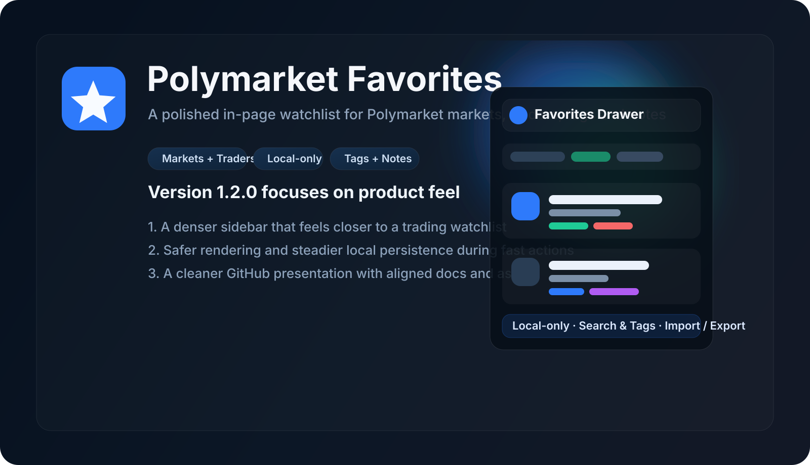
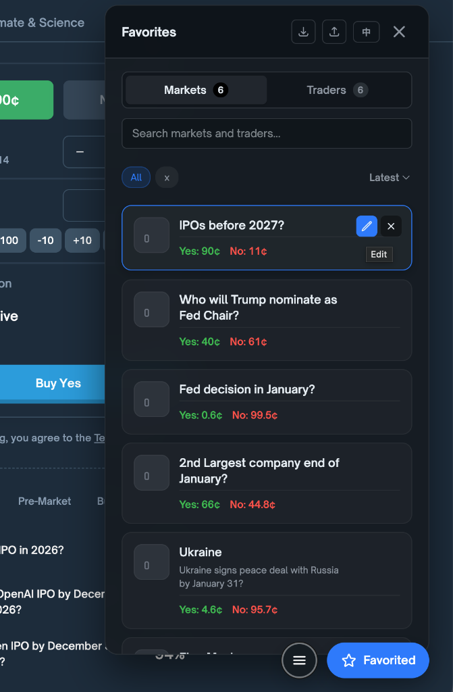

# Polymarket Favorites

  

  <strong>把 Polymarket 缺失的收藏能力补上。</strong> 
  收藏市场与交易员，打标签、写备注、做本地整理，不依赖浏览器书签硬扛。

  
  
  
  

---

## 中文

### 这是什么

`Polymarket Favorites` 是一个页内增强插件。

它会直接在 `polymarket.com` 页面里注入一个浮动工具栏和收藏侧栏，让你可以：

- 一键收藏市场
- 一键收藏交易员主页
- 给收藏对象写备注、重命名、打标签
- 按标签、名称、时间筛选与排序
- 导出 / 导入本地数据
- 调整侧栏尺寸，按自己的盯盘习惯摆放

这次整理后的主线体验是：**页内侧栏为主，所有数据只保存在本地浏览器里。**

### 当前版本重点优化

- 修掉了内容脚本重复初始化的问题，避免同页注入多次。
- 把高开销的全局 DOM 监听，收敛成更轻量的 SPA 导航感知。
- 给备注、标签、标题等渲染补上转义，避免直接拼进 DOM。
- 给本地存储写入补了轻量防抖，减少频繁操作时的抖动和重复写入。
- 侧栏改成更像交易终端的收藏抽屉，重做了摘要区、搜索区、空状态与卡片层级。
- 面板开关、语言切换、Esc 关闭、搜索聚焦、视口边界保护等细节也一起收紧了。
- README、商店文案、发帖文案统一到真实功能，不再“代码一套、文档一套”。

### 功能一览

- `Markets + Traders`：同时支持市场和交易员收藏
- `Notes + Tags`：支持自定义备注名与标签
- `Search + Filter + Sort`：搜索、标签筛选、按时间/名称排序
- `Resizable Panel`：支持拖拽调整宽度和高度
- `Import / Export`：本地 JSON 备份与合并导入
- `Local-only`：不上传你的收藏数据

### 为什么这版更像成品

- 入口更清楚：全局面板按钮、市场收藏按钮、交易员收藏按钮统一为同一套浮层语言
- 面板更像工具：摘要卡、搜索框、筛选标签、卡片信息层级重新排过，不再像“列表弹窗”
- 空状态更有指引：空收藏和筛选无结果都给明确反馈，而不是只剩一块空白
- 高频操作更稳：写入做了轻量防抖，渲染走调度，切页和反复收藏时更不容易抖动
- 更适合演示：仓库口径、题图、商店文案和实际功能一致，打开 GitHub 就能看懂产品定位

### 这次深改的体验方向

- 更像盯盘工具，不像普通书签面板
- 面板信息层级更清楚，空列表和筛选后无结果也有明确反馈
- 频繁收藏、编辑、切页时更稳，不容易因为 SPA 刷新节奏而失效
- 移动和窄窗口下更克制，不会一下把页面压坏

### 安装

#### 方式 1：Chrome 扩展

1. 拉取或下载本仓库
2. 打开 `chrome://extensions/`
3. 开启右上角“开发者模式”
4. 点击“加载已解压的扩展程序”
5. 选择 [chrome-extension](/Volumes/AI/polymarket-/polymarket-favorites/chrome-extension)

#### 方式 2：Tampermonkey Userscript

1. 安装 [Tampermonkey](https://www.tampermonkey.net/)
2. 打开 [polymarket-assistant.user.js](https://github.com/dunova/polymarket-favorites/raw/main/polymarket-assistant.user.js)
3. 按提示安装

### 使用方式

1. 打开任意 Polymarket 市场页或交易员主页
2. 页面右下角会出现浮动按钮
3. 点击收藏按钮，把当前对象加入列表
4. 点击面板按钮，打开收藏侧栏
5. 在侧栏里做搜索、标签整理、备注编辑和导入导出

### 界面预览

### 技术主线

- `Userscript` 与 `Chrome Extension` 现在沿着同一套页内侧栏主线迭代
- 数据模型只保留 `markets / traders / tags / customName / savedAt`
- 存储只走浏览器本地，不引入独立后端
- 页面感知以 SPA 导航监听为主，避免全局高成本 DOM 盯梢

### 仓库结构

- [chrome-extension/content.js](/Volumes/AI/polymarket-/polymarket-favorites/chrome-extension/content.js)
  Chrome 扩展的主实现，当前主线能力在这里
- [polymarket-assistant.user.js](/Volumes/AI/polymarket-/polymarket-favorites/polymarket-assistant.user.js)
  与扩展主线同步的 Tampermonkey 版本
- [store-assets/listing_text.md](/Volumes/AI/polymarket-/polymarket-favorites/store-assets/listing_text.md)
  Chrome Web Store 文案

### 隐私

- 收藏数据保存在浏览器本地存储
- 不依赖你自己的后端
- 不上传备注、标签和列表内容

---

## English

### What It Is

`Polymarket Favorites` adds an in-page favorites workflow to Polymarket.

Instead of juggling browser bookmarks, you can save markets and trader profiles directly inside the site, organize them with notes and tags, and keep everything local to your browser.

### Core Features

- Favorite markets and trader profiles from the page itself
- Add custom names, notes, and tags
- Search, filter, and sort your saved items
- Resize the floating side panel
- Export and import local JSON backups
- Keep everything local-only

### Install

#### Chrome Extension

1. Download or clone this repository
2. Open `chrome://extensions/`
3. Enable Developer Mode
4. Click `Load unpacked`
5. Select [chrome-extension](/Volumes/AI/polymarket-/polymarket-favorites/chrome-extension)

#### Userscript

1. Install [Tampermonkey](https://www.tampermonkey.net/)
2. Open [polymarket-assistant.user.js](https://github.com/dunova/polymarket-favorites/raw/main/polymarket-assistant.user.js)
3. Confirm installation

### Screenshot

  

### License

MIT
